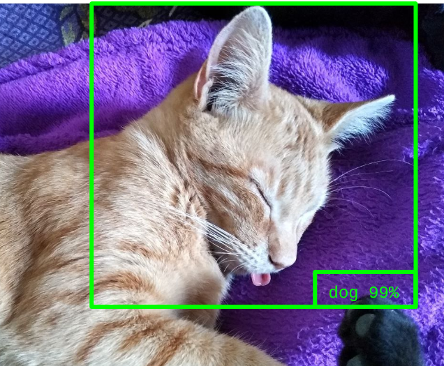

# Michigrad
Pequeño Autograd con fines educativos.

Clon de Micrograd de [Andrej Karpathy](https://github.com/karpathy/micrograd) y básicamente comparte la misma base de código. Se mejoraron algunos aspectos de la visualización, orientados al curso de Nociones de Deep Learning para Inteligencia Artificial Generativa de Texto de [Purrfect AI](https://purrfectai.online)
