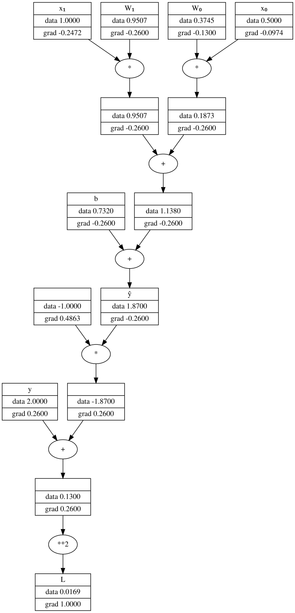

# Michigrad
Pequeño Autograd con fines educativos.


Clon de Micrograd de [Andrej Karpathy](https://github.com/karpathy/micrograd) y básicamente comparte la misma base de código. Se mejoraron algunos aspectos de la visualización, orientados al curso de Nociones de Deep Learning para Inteligencia Artificial Generativa de Texto de [Purrfect AI](https://purrfectai.online)


```python
import numpy as np
from michigrad.engine import Value
from michigrad.visualize import show_graph

np.random.seed(42)
W0 = Value(np.random.random(), name='W₀')
W1 = Value(np.random.random(), name='W₁')
b = Value(np.random.random(), name='b')
print(W0)  # imprime Value(data=0.3745401188473625, grad=0, name=W₀)

x0 = Value(.5, name="x₀")
x1 = Value(1., name="x₁")
y = Value(2., name="y")

yhat = x0*W0 + x1*W1 + b
yhat.name = "ŷ"
print(yhat)  # imprime Value(data=1.8699783076450025, grad=0, name=ŷ)

L = (y - yhat) ** 2
L.name = "L"
print(L)  # imprime
L.backward()
print(L)  # imprime Value(data=0.016905640482857615, grad=1, name=L)
print(W0)  # imprime Value(data=0.3745401188473625, grad=-0.1300216923549975, name=W₀)

show_graph(L, rankdir="TB",format="png")
```

